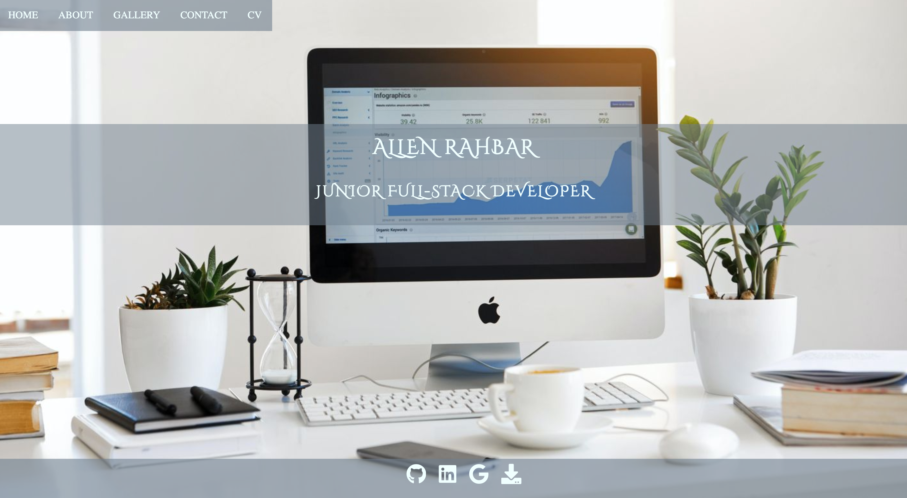
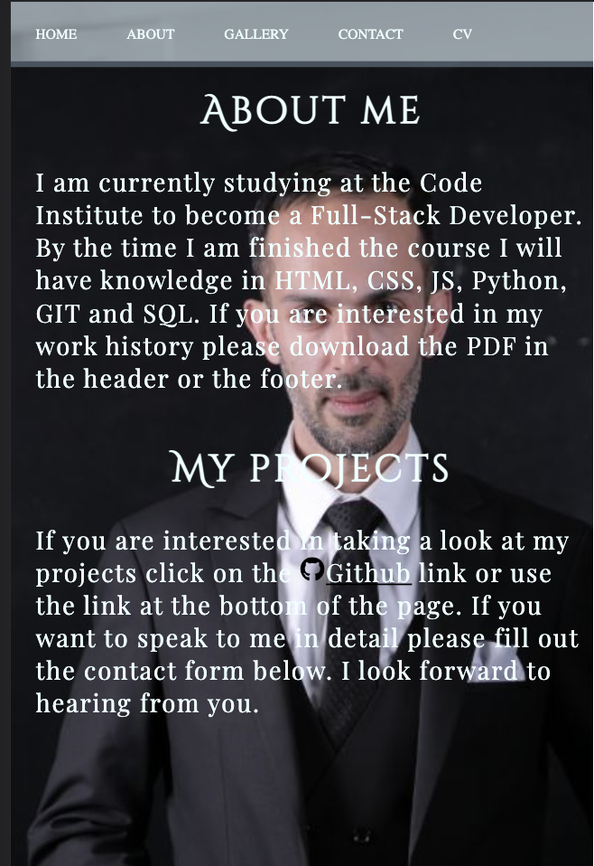
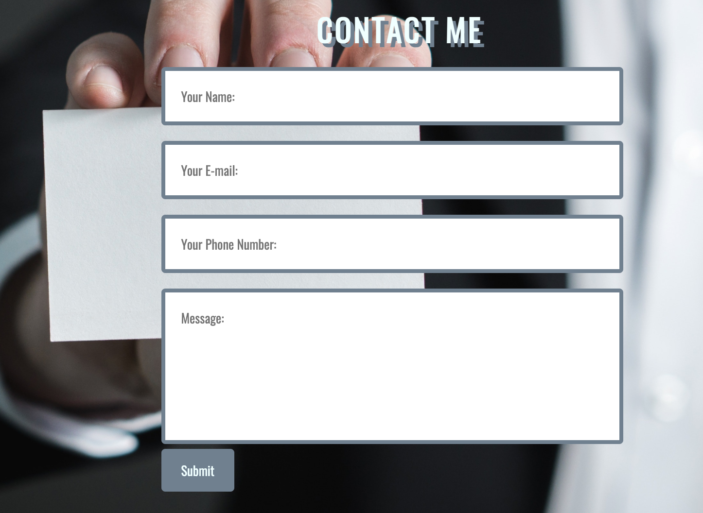

# Allen Rahbar Portfolio
This is my personal website to present to prospective employers. Users of the site will be able to see my personal info, about me, projects,a small gallery of me teaching and doing volunteer work and download my CV (to see my work history, education etc.) and contact information. This site is targeted for potential employers.

## Demo 
A live demo of the site can be found  [here](https://allenrahbar.github.io/projectone/) .

## Wireframes
### Mobile
- [Landing page](assets/wireframes/wiremainmobile.png)
- [About me](assets/wireframes/wireaboutmobile.png)
- [Images](assets/wireframes/wireimagesmobile.png)
- [Contact me](assets/wireframes/wirecontactmobile.png)

### Tablet
- [Landing page](assets/wireframes/wiremaintablet.png)
- [About me](assets/wireframes/wireabouttablet.png)
- [Images](assets/wireframes/wireimagestablet.png)
- [Contact me](assets/wireframes/wirecontacttablet.png)

### Laptop/PC
- [Landing page](assets/wireframes/wiremainpc.png)
- [About me](assets/wireframes/wireaboutpc.png)
- [Images](assets/wireframes/wireimagespc.png)
- [Contact me](assets/wireframes/wirecontactpc.png)

## Technologies Used
- HTML 
- CSS

## Programs Used
- Balsamiq for wireframes.
- Gitpod to write the code.
- Github used to store the repository.
- Google fonts was used for all text on the site.
- Fontawesome used for icons.

## Features
The features of the site are very basic. The navigation bar is fixed on the page for users to be able to navigate to any page at any time with ease. Cv can be downloaded from header and footer.The landing page is a simple page with my name and job title. You can read a little bit about me in the about section and see my picture. In the images section there are a few images of me teaching, my teaching certificate and me volunteering for an animal shelter. In the contact section there is a form to fill out if anyone wants to contact me. The footer has links to github, linkedin, gmail. 

- __Navigation Bar__
- The navigation bar is situated on top of the page on mobile devices and in the top left on tablets and PCs/Laptops. All pages of the website are in one file and the navigation bar is fixed to always follow the user when scrolling on the page if they wish to return to a previous section.

- __Landing Page__
- The landing page has a background image of a laptop along with my name and job title to show the user what the page is about.

- __About me__
- The about me section has a picture of me to give a personal touch to the page and for employers to see me. The about me text has my current role along with skills that I will be acquiring. The my projects section informs employers how to access my projects and how to contact me.

- The background image for this page changes on mobile devices and tablets because the white background was not suitable for small devices.

- __Images__
- The gallery has 4 images of me working as a teacher, my teaching certificate and me doing volunteer work. This was created for users to see my work. Alt attribue has been added for users that can't view images.

- __Contact me__
- The contact me section has a form to fill out for anyone that wishes to contact me for employment opportunities. All fields are required to be filled out by the user to be able to submit the form. 

- __Footer__
- The footer has 4 fontawesome icons for my Github, LinkedIn, Gmail and a link to download my CV. The footer is fixed on every page of the website for the user to always have accesibility to the links. All links will open in a new tab except the download button which will download the CV to the users default downloads folder.

## Features left to implement
This is an ongoing project that I will be working on for the duration of my working life. The site will be updated with javascript and more interactive features will be added when I have learned the skills necessary to do this. The images section will be replaced with an image of all my projects along with a link to access each project. I would also like to make the contact me section be able to send me an email for when users fill out the form.

## Testing 
The user testing of the site achieved its purpose. It's easy to navigate between sections. The users will be able to see a little bit about me in the about section and download the PDF for a full list of my workhistory and education. They are also able to view my Github, LinkedIn and Download my CV.

During testing for responsiveness I noticed that the images weren't responsive on all devices. This was fixed by changing the height on all images to fit the viewport of the device. Another thing I noticed was that the text in the about me section was overlapping the image on smaller devices. I fixed this by changing the background picture and text colorfor smaller devices. I have tested the responsiveness from small devices all the way up to 5k resolution and have confirmed that it is responsive. Media queries were added for changes depending on the size of the screen so that the information on the site is clearly visible on all devices.

The navbar wasn't working when you scroll down on other pages. This was fixed by adding a z-index to the navbar. 

All links in the header and footer open in a new tab except for the download button which downloads the CV to your default downloads folder. Everything has been manually tested to confirm that it works.

If you try to submit any of the information in the contact form you will not be able to proceed because all fields are required to be filled out.

The live site has been tested on Google Chrome, Firefox, Safari and Edge. The site has also been tested on several devices using dev tools to confirm that its responsive on all devices.

## Validator Testing

- HTML no errors were returned when passing through the official [W3C validator](https://validator.w3.org/nu/?doc=https%3A%2F%2Fallenrahbar.github.io%2Fprojectone%2Findex.html)
- CSS no errors were returned when passing through the offical [Jigsaw validator](https://jigsaw.w3.org/css-validator/validator?uri=https%3A%2F%2Fallenrahbar.github.io%2Fprojectone%2Findex.html&profile=css3svg&usermedium=all&warning=1&vextwarning=&lang=en)

## Deployment

This site was deployed using GitHub Pages with the following the steps below:

1. Login or Sign Up to [GitHub](www.github.com).
2. Create a new repository named "MS1-Project".
3. Once created, click on "Settings" on the navigation bar under the repository title.
4. Click on "Pages", on the left hand side below Secrets.
5. Under "Source", choose which branch you wish to deploy, In most cases it will be "main".
6. Choose which folder to deploy from, generally from "/root".
7. Click "Save", then wait for it to be deployed. It may take some time for the page to be fully deployed.
8. The URL will be displayed above the "source" section in GitHub Pages.

 

