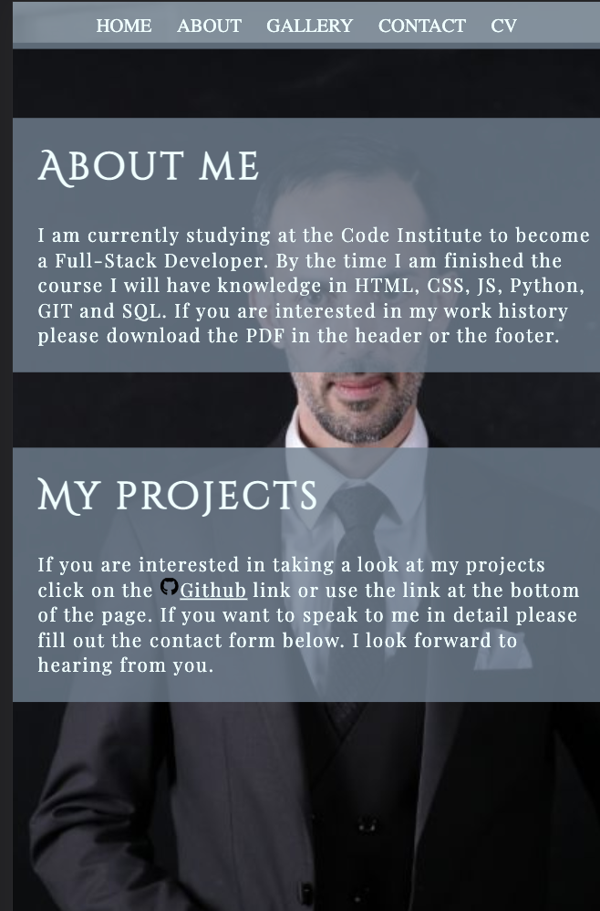
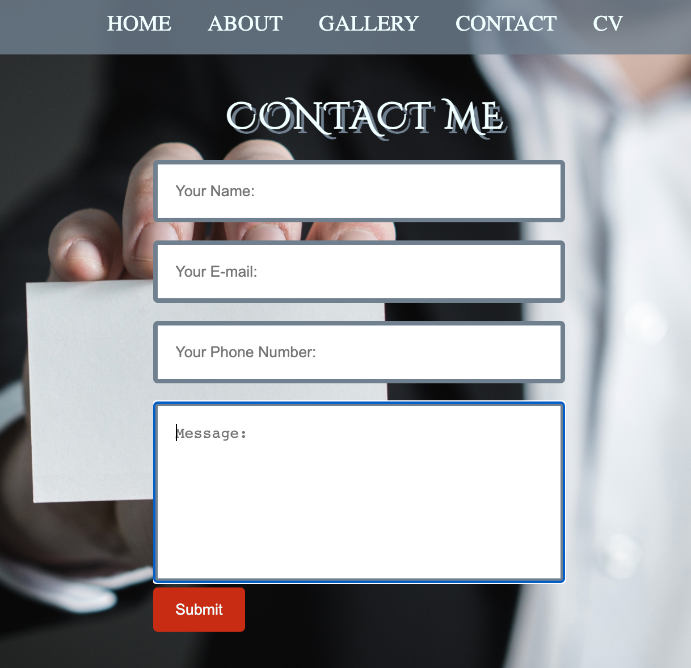
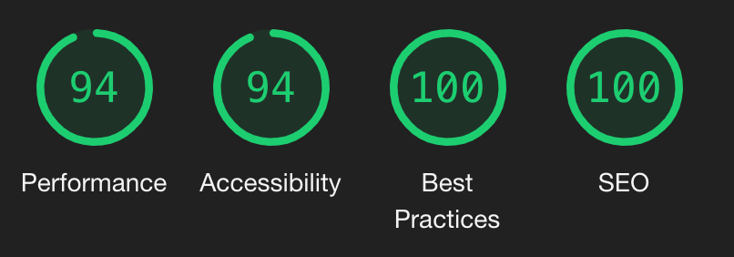
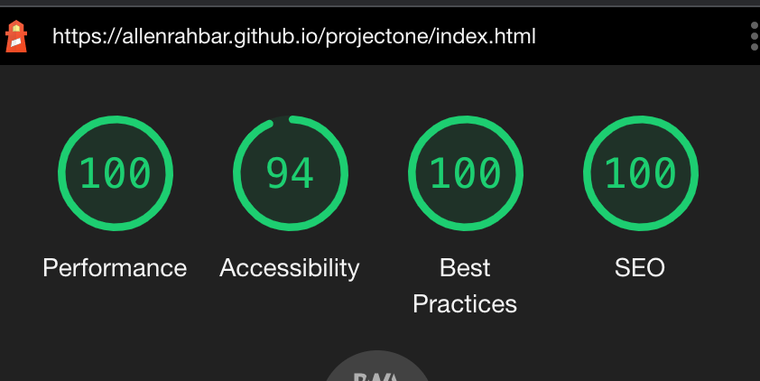

# Allen Rahbar Portfolio
This is my personal website to present to prospective employers. Users of the site will be able to see my personal info, about me, projects, a small gallery of me teaching and doing volunteer work, and download my CV (to see my work history, education, etc.) and contact information. This site is targeted at potential employers. The color scheme is grey and white mostly.

## Demo 
A live demo of the site can be found  [here](https://allenrahbar.github.io/portfolio-project-one/) .

## Wireframes
### Mobile
- [Landing page](assets/wireframes/wiremainmobile.png)
- [About me](assets/wireframes/wireaboutmobile.png)
- [Images](assets/wireframes/wireimagesmobile.png)
- [Contact me](assets/wireframes/wirecontactmobile.png)

### Tablet
- [Landing page](assets/wireframes/wiremaintablet.png)
- [About me](assets/wireframes/wireabouttablet.png)
- [Images](assets/wireframes/wireimagestablet.png)
- [Contact me](assets/wireframes/wirecontacttablet.png)

### Laptop/PC
- [Landing page](assets/wireframes/wiremainpc.png)
- [About me](assets/wireframes/wireaboutpc.png)
- [Images](assets/wireframes/wireimagespc.png)
- [Contact me](assets/wireframes/wirecontactpc.png)

## Technologies Used
* HTML - Mark-up language using semantic structure.
* CSS -  Cascading style sheet used to style.
* JS - JS was only used for submitting the form.
* Gitpod.io - for writing the code. Using the command line for committing and pushing to Git Hub
* GitHub - Used to host repository 
* GIT - for version control of the project.

## Programs Used
* Balsamiq -for wireframes.
* Gitpod - to write the code.
* Github - is used to store the repository.
* GIT - for version control of the project.
* Google fonts - were used for all text on the site.
* Fontawesome - used for icons.
* Grammerly - used for checking for spelling and grammar typos for README.
* Favicon - used to create favicon for page.
* Tiny PNG - to resize images.
* Beautifier.io - to clean up HTML and CSS text

## Design
I wanted to make a visual page and not have too much content to keep the user interested. For colors I chose grey and white except for the contact page which has a black background. I experimented with several background images, fonts, and different text backgrounds until I finally got a website which I think is visually appealing for the user.

## User Story
This site is designed for employers or recruiters to have a look and see if they want to be in further contact for employment. In the future when I have added more projects it might be for fellow coders who would like to collaborate on projects as well.
* If recruiters go on the site they will need my work history which is easily accesible to download via the navbar and the footer.
* If employers go on the site they will most likely be interested in my projects which they can view via the Github link in the My Projects section and in the footer. 

The site has been adapted for the target audience. More information will be addded as soon as I have completed more projects/hackathons and updated my CV.

## Features
The features of the site are very basic. The navigation bar is fixed on the page for users to be able to navigate to any page at any time with ease. Cv can be downloaded from the header and footer. The landing page is a simple page with my name and job title. You can read a little bit about me in the about section, acces my github in the my projects section, and see my picture. In the images section there are a few images of me teaching, my teaching certificate, and me volunteering for an animal shelter. In the contact section, there is a form to fill out if anyone wants to contact me. The footer has links to Github, Linkedin, Gmail. 

- __Navigation Bar__
- The navigation bar is situated on the top center on all devices. In my opinion the navbar is ok and its easy to click on all the links even on a mobile . All pages of the website are in one file and the navigation bar is fixed to always follow the user when scrolling on the page if they wish to return to a previous section. Opacity was added to the navbar so that it doesn't cover any important information. 

- __Landing Page__
- The landing page has a background image of a laptop along with my name and job title to show the user what the page is about. A greyscale background color was added to the text so that it can be clearly visible on all devices.

- __About me__
- The about me section has a picture of me to give a personal touch to the page and for employers to see me. The about me text has my current role along with skills that I will be acquiring. The my projects section informs employers how to access my projects and how to contact me.

- The background image for this page changes on mobile devices and tablets because the white background was not suitable for small devices.

- __Images__
- The gallery has 4 images of me working as a teacher, my teaching certificate, and me doing volunteer work. This was created for users to see my work. Alt attribute has been added for users that can't view images.

- __Contact me__
- The contact me section has a form to fill out for anyone that wishes to contact me for employment opportunities. All fields are required to be filled out by the user to be able to submit the form. When you click on the submit button you will get a popup message saying the form has been submitted and that I will be in touch ASAP.

- __Footer__
- The footer has 4 fontawesome icons for my Github, LinkedIn, Gmail, and a link to download my CV. The footer is fixed on every page of the website for the user to always have accessibility to the links. All links will open in a new tab except the download button which will download the CV to the users default downloads folder. If you click on the download button on mobile devices it will open the PDF on the same page. Opacity was added so the page isn't covered.

- __Favicon__
- Favicon was created with an image of myself on Favicon.

## Features left to implement
This is an ongoing project that I will be working on for the duration of my working life. The site will be updated with javascript and more interactive features will be added when I have learned the skills necessary to do this. The images section will be replaced with an image of all my projects along with a link to access each project. I would also like to make the contact me section be able to send me an email when users fill out the form.

## Testing 
The user testing of the site achieved its purpose. It's easy to navigate between sections. The users will be able to see a little bit about me in the about section and download the PDF for a full list of my work history and education. They are also able to view my Github, LinkedIn and Download my CV.

During testing for responsiveness, I noticed that the images weren't responsive on all devices. This was fixed by changing the height on all images to fit the viewport of the device. Another thing I noticed was that the text in the about me section was overlapping the image on smaller devices. I fixed this by changing the background picture and text color for smaller devices. I have tested the responsiveness from small devices up to 5k resolution and have confirmed that it is responsive. Media queries were added for changes depending on the size of the screen so that the information on the site is visible on all devices.

When testing for when you tilt the mobile horizontally I noticed that there was an issue with the form page. You couldn't click on the submit button. This was fixed by making the size of the footer smaller and changing the margins for the form.

The navbar wasn't working when you scroll down on other pages. This was fixed by adding a z-index to the navbar. 

All links in the header and footer open in a new tab except for the download button which downloads the CV to your default downloads folder. Everything has been manually tested to confirm that it works.

The color for the submit button was hard to see on mobile devices. I changed the color to make it more visible.

If you try to submit any of the information in the contact form you will not be able to proceed because all fields are required to be filled out.

The live site has been tested on Google Chrome, Firefox, Safari, and Edge. The site has also been tested on several devices using dev tools to confirm that it's responsive on all devices.

## Function Testing
| Test Label | Test Action                   | Expected Outcome                                                                                | Test Outcome |
|------------|-------------------------------|-------------------------------------------------------------------------------------------------|--------------|
| Navbar     | Hover Click on links          | Links should take you to the appropriate section. When you hover the color should be black.  | PASS         |
| Download   | Click on CV  Click on DL Icon | The Cv should download.                                                                         | PASS         |
| Form       | Input information             | All information is required. If its not entered you will not be able to continue.              | PASS         |
| Submit     | Click on submit               | A popup message that your form has been sent when you submit.                                  | PASS         |
| Footer     | Click on icons                | All icons should open in new tab.                                                               | PASS         |

## Validator Testing

- HTML no errors were returned when passing through the official [W3C validator](https://validator.w3.org/nu/?doc=https%3A%2F%2Fallenrahbar.github.io%2Fportfolio-project-one%2F)
- CSS no errors were returned when passing through the official [Jigsaw validator] (https://jigsaw.w3.org/css-validator/validator?uri=https%3A%2F%2Fallenrahbar.github.io%2Fportfolio-project-one%2F&profile=css3svg&usermedium=all&warning=1&vextwarning=&lang=en)

## Lighthouse Testing
I ran several tests in Lighthouse and noticed that the performance was low, the reason for this was that the image sizes were too large. I resized the images and readded them and got the score I wanted. The score for Desktop was slightly higher than for Mobile but I am satisfied with the results.

## Deployment

This site was deployed using GitHub Pages with the following steps below:

1. Login or Sign Up to [GitHub](www.github.com).
2. Create a new repository named "portfolio-project-one".
3. Once created, click on "Settings" on the navigation bar under the repository title.
4. Click on "Pages", on the left hand-side below Secrets.
5. Under "Source", choose which branch you wish to deploy, In most cases, it will be "main".
6. Choose which folder to deploy from, generally from "/root".
7. Click "Save", then wait for it to be deployed. It may take some time for the page to be fully deployed.
8. The URL will be displayed above the "source" section in GitHub Pages.

### HOW TO FORK A REPOSITORY

If you need to make a copy of a repository:

1. Login or Sign Up to [GitHub](www.github.com).
2. On GitHub, go to [allenrahbar/portfolio-project-one](https://github.com/allenrahbar/portfolio-project-one).
3. In the top right corner, click "Fork".

### HOW TO CLONE A REPOSITORY

If you need to make a clone:    

1. Login to [GitHub](www.github.com).
2. Fork the repository allenrahbar/projectone using the steps above in [How To Fork a Repository](#HOW-TO-FORK-A-REPOSITORY).
3. Above the file list, click "Code".
4. Choose if you want to close using HTTPS, SSH, or GitHub CLI, then click the copy button to the right.
5. Open Git Bash.
6. Change the directory to where you want your clone to go.
7. Type git clone and then paste the URL you copied in step 4.
8. Press Enter to create your clone.

### HOW TO MAKE A LOCAL CLONE

If you need to make a local clone:   

1. Login to [GitHub](www.github.com).
2. Under the repository name, above the list of files, click "Code".
3. Here you can either Clone or Download the repository.
4. You should close the repository using HTTPS, clicking on the icon to copy the link.
5. Open Git Bash.
6. Change the current working directory to the new locaiton, where you want the cloned directory to be.
7. Type git clone and then paste the URL you copied in step 4.
8. Press Enter, and your local clone will be created.

## Credits

## Content
- Inspiration from the page was taken from [Haley Schafer](https://www.haleyschafer.com/)
- The fonts were taken from [Google fonts](https://fonts.google.com/).
- The icons in the footer were taken from [Fontawesome](https://fontawesome.com/).
- Help with coding was taken from [https://www.w3schools.com/]
- Facicon was created on [https://favicon.io/]
- The code taken has been added in the comments, in the HTML and CSS file.

## Media
- The image from the landing page was taken from [Templatemo](https://templatemo.com/)
- The image from the contact me page was taken from [Pexels](https://www.pexels.com/)
- I own the rights to the images in the about me and images section.

## Acknowledgement
I would like to thank the Code Institute for providing the lessons necessary to be able to complete this project. My mentor Brian Macharia for all his guidance. My friend [Emanuel Silva](https://github.com/manni8436) for helping answer any questions I had and also with testing the site. This was a great learning experience!

 

